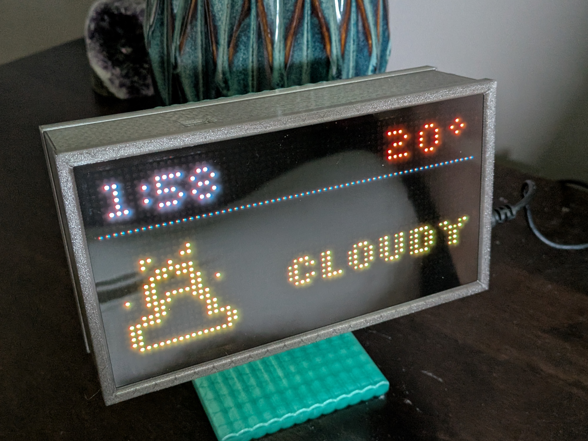

# Home Assistant Bedroom Clock
Bedroom Clock that displays time and weather data directly driven from Home Assistant. 

I should note that the ESPhome Yaml was created with the asistance of Claude

This clock uses a BH1750 to detect the ambiant light level in the room and has two modes based on the brightness in the room. A day time mode and a night time mode. In night mode it only displays the time and the temperature. The temperature in my case come from my weather station outside but of course this can be driven by any soruce in your HA ecosystem. In day time mode it displays the time, temperature and the wethaer data from what ever weather entities you have avilable. In my case I use Environment Canada. 

The housing is modeled in Fusion. The back and ND film holder both are a friction fit and stay in place well enough. The ND film helps bring the brightness down if you think the lowest intensity is too bright. Im told it also make the device look more proffesional.

The display is a 64x32 RGB matrix Purchased from [Amazon](https://www.amazon.ca/dp/B0BR7WTW2G?ref_=ppx_hzod_title_dt_b_fed_asin_title_0_0&th=1).

The driver board is a ESP#@ matrix driver board also purchaed from [Amazon](https://www.amazon.ca/dp/B0GYDMQKGN?ref_=pe_125682630_1045605200_t_fed_asin_title).

The Light sensor is also from [amazon](https://www.amazon.ca/dp/B0DDCD3VZC?ref=ppx_yo2ov_dt_b_fed_asin_title)
